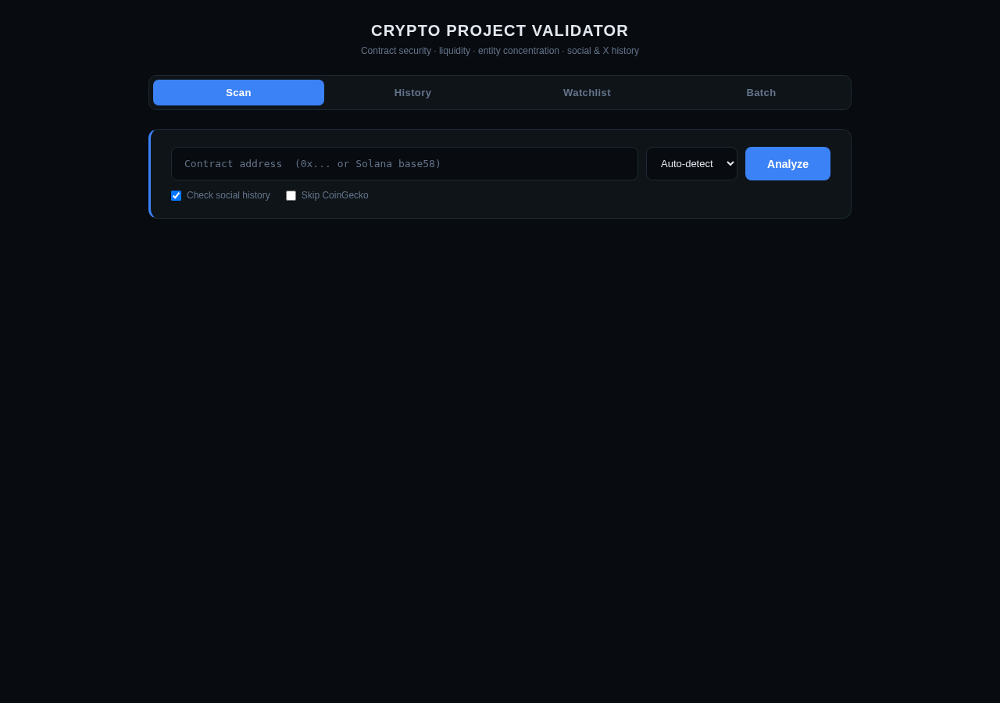
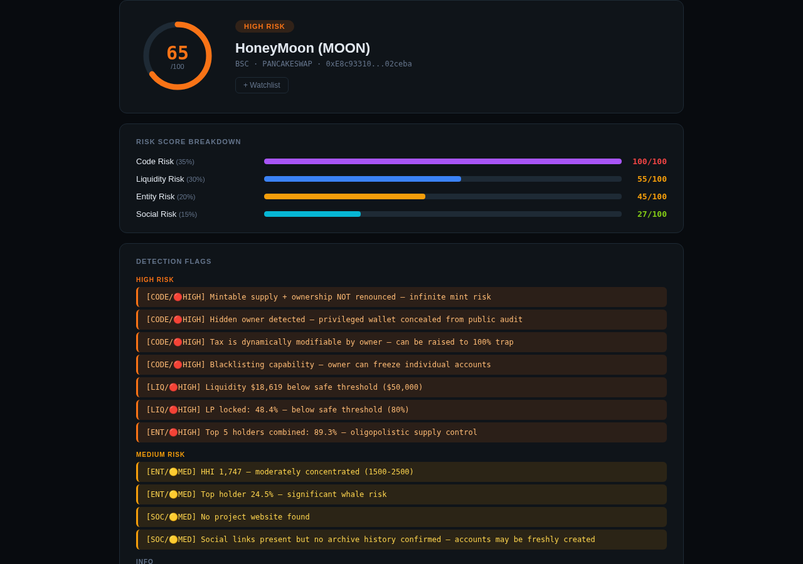

# CryptoScan

Automated cryptocurrency scam detection engine. Input a token contract address — get back a quantified risk score built from four independent analysis pipelines: smart contract security, liquidity pool integrity, on-chain entity concentration, and social presence auditing.

Designed for EVM chains (Ethereum, BSC, Base, Polygon, Arbitrum, Avalanche, Optimism) and Solana.

---

## Why this exists — the risk it addresses

Retail crypto investors routinely make buy decisions off a handful of positive signals — a locked liquidity pool, an active Twitter account, a large holder count — without checking whether any of those signals were manufactured. This tool replaces that gut-check with a reproducible, four-dimensional read across code, liquidity, holder concentration, and social presence, so a decision has to survive contact with actual contract bytecode and on-chain data, not just vibes.

## Safety, autonomy & ethical design

- **Deterministic, auditable scoring — no LLM judgment call in the loop.** Every score is a fixed formula over structured data from free, permissionless APIs. Anyone can recompute a result by hand from the same inputs; nothing here is a black-box opinion.
- **Circuit breakers exist because linear scoring fails exactly when it matters most.** A token with deep liquidity and a large, active community can still be a 100%-loss honeypot — see the Boolean Circuit Breaker section below for why a single deterministic fraud signature is designed to override every other positive input, rather than being averaged away by them.
- **Autonomy boundary: this tool scores and reports, it never acts.** It doesn't trade, doesn't hold funds, and doesn't execute anything against the tokens it evaluates — the output is a number and a breakdown for a human to weigh, full stop.
- **Ethical/responsible-use notes:** every data source is free and permissionless (no scraping behind a paywall or authentication wall, no ToS-violating access); the tool is explicitly a due-diligence aid, not investment advice, and it can produce false negatives (see Limitations below) — a low score is evidence of absence of certain red flags, not proof of legitimacy. It should never be the only check before risking real capital.

---

## Dashboard

A Flask-based dashboard is included and runs on port 5006.

### Home



### Fraud Detection in Action

The following scan is of **HoneyMoon (MOON)** — a BSC token with four HIGH-severity code flags: the owner can mint unlimited tokens, the sell tax is dynamically raisable to 100% (the honeypot mechanism), blacklisting allows the owner to freeze individual wallets, and a hidden privileged wallet is concealed from public audit.



Code Risk scores **100/100** — the maximum. Overall risk score is **65/HIGH RISK**.

---

## How It Works

The validator orchestrates four data pipelines and synthesizes their outputs into a single composite risk score. Each pipeline targets a distinct fraud vector documented in the academic and forensic literature on decentralized finance exploitation.

```
Contract Address
      │
      ├─── [1] GoPlus Security API      → Code Risk Score
      ├─── [2] DexScreener API          → Liquidity Risk Score
      ├─── [3] On-Chain Holder Analysis → Entity Risk Score
      └─── [4] CoinGecko / DexScreener  → Social Risk Score
                                                │
                                         Scoring Engine
                                                │
                                      Final Risk Score (0–100)
```

---

## Risk Scoring System

The core of the validator is a **weighted composite scoring model** with **Boolean circuit breakers** — a non-linear override mechanism that immediately flags tokens containing deterministic, unambiguous fraud signatures regardless of any other positive signals.

### Composite Score Formula

```
Score = (Code × 0.35) + (Liquidity × 0.30) + (Entity × 0.20) + (Social × 0.15)
```

Weights are calibrated against post-mortem analyses of major DeFi exploits. Smart contract vulnerabilities and liquidity manipulation are the highest-predictive-power signals for catastrophic fund loss, and receive the heaviest weighting accordingly.

### Boolean Circuit Breakers

Linear scoring breaks down in the presence of deterministic malicious code. A token with $10M locked liquidity, 50,000 holders, and an active Twitter community still represents **100% risk of total loss** if the contract contains a hardcoded honeypot.

Circuit breakers override the composite formula entirely:

| Trigger | Override |
|---|---|
| Confirmed honeypot (GoPlus `is_honeypot=1`) | Score → 100, **CONFIRMED SCAM** |
| Sell tax ≥ 50% | Score → 100, **CONFIRMED SCAM** |

When no circuit breaker fires, the weighted model applies dynamically across four dimensions.

### Score Interpretation

| Score | Verdict | Meaning |
|---|---|---|
| 0–19 | **LIKELY SAFE** | No significant red flags detected |
| 20–39 | **LOW RISK** | Minor concerns, proceed with due diligence |
| 40–59 | **MEDIUM RISK** | Elevated flags, significant caution warranted |
| 60–79 | **HIGH RISK** | Multiple serious red flags, likely predatory |
| 80–99 | **EXTREME RISK** | Near-certain scam, do not invest |
| 100 | **CONFIRMED SCAM** | Circuit breaker triggered, deterministic fraud detected |

---

## Analysis Pipelines

### 1. Code Risk (35% weight)
**Source:** [GoPlus Security API](https://gopluslabs.io/en/token-security-api) — free, permissionless, 30+ detection vectors.

Evaluates the compiled bytecode and contract architecture for hardcoded malicious logic:

- **Honeypot detection** — transfer restrictions that block non-whitelisted addresses from selling
- **Infinite mint backdoors** — hidden functions allowing the deployer to generate unlimited supply
- **Hidden owner** — obfuscated privileged wallet concealed from public audit tools
- **Upgradeable proxy risk** — unrenounced proxy contracts that can silently swap to a malicious implementation
- **Dynamic tax manipulation** — `sell_tax` variables modifiable by the owner at runtime (can be raised to 100%)
- **Blacklisting capability** — `mapping(address => bool)` structures enabling selective account freezing
- **Source code verification** — unverified bytecode cannot be audited; scored accordingly
- **Ownership status** — active vs. renounced, with renounced ownership reducing score

### 2. Liquidity Risk (30% weight)
**Source:** DexScreener (market data) + GoPlus (LP holder analysis).

Monitors the health of the token's liquidity pool — the most critical infrastructure for a soft rug pull:

- **LP token lock status** — percentage of Liquidity Provider tokens cryptographically locked via audited third-party timelocks (UNCX Network, Team Finance, etc.) vs. held in an unlocked deployer wallet
- **Total Value Locked (TVL)** — absolute pool depth; shallow pools are trivially manipulable
- **Buy/sell ratio anomaly** — extreme buy imbalance (>10:1) with near-zero sells is a wash trading or honeypot signal
- **Volume/liquidity ratio** — volume exceeding 50× pool depth indicates artificial activity the pool cannot organically sustain

### 3. Entity Risk (20% weight)
**Source:** GoPlus top-holder data.

Runs concentration analysis on the token's holder distribution to detect hidden insider control — a prerequisite for pump-and-dump execution:

- **Gini Coefficient** — measures inequality across the known holder distribution. Scores above 0.85 indicate extreme centralization. A Gini of 0 = perfect equality; 1.0 = single entity controls everything.
- **Herfindahl-Hirschman Index (HHI)** — squares the market share of each entity, heavily penalizing top-heavy distributions. HHI > 2,500 is the regulatory threshold for monopolistic concentration. Applied directly to token supply.
- **Top-holder concentration** — explicit flags when the top 1 holder exceeds 20%/50%, or when the top 5 combined exceed 80%
- **Creator wallet tracking** — flags if the deploying address still holds a material percentage of supply
- **Benford's Law analysis** — chi-square test on raw holder balances; significant deviation from Benford's expected distribution can indicate artificial balance construction

### 4. Social Risk (15% weight)
**Source:** DexScreener profile metadata + CoinGecko community data + Wayback Machine + RDAP + X/Twitter syndication API.

Audits the off-chain social footprint for signs of synthetic community construction:

- **Presence audit** — anonymous tokens with no verifiable Twitter/Telegram/website receive significant risk additions
- **Social history verification** — Wayback Machine CDX API checks when social URLs first appeared; accounts created days before launch are a red flag
- **Domain age** — RDAP registration data confirms how long the project website domain has existed
- **X/Twitter account age** — snowflake ID decoding determines exact account creation date; accounts under 90 days old with low follower counts score poorly
- **Follower count thresholds** — Twitter followers < 500 treated as a high-risk signal for newly spun-up bot farms
- **Price/engagement anomaly** — price increases > 200% combined with buy-only 1h transaction pressure flag the classic pump-and-dump execution pattern

---

## Usage

```bash
# Auto-detect chain from DexScreener
python3 crypto_scan.py 0x6982508145454Ce325dDbE47a25d4ec3d2311933

# Specify chain explicitly
python3 crypto_scan.py 0x6982508145454Ce325dDbE47a25d4ec3d2311933 eth

# Solana token
python3 crypto_scan.py EPjFWdd5AufqSSqeM2qN1xzybapC8G4wEGGkZwyTDt1v solana

# Send result via Telegram
python3 crypto_scan.py 0xADDRESS eth --telegram

# Write JSON output
python3 crypto_scan.py 0xADDRESS eth --json

# Skip CoinGecko (avoid rate limits on batch runs)
python3 crypto_scan.py 0xADDRESS eth --no-coingecko

# Add to watchlist (monitored via cron + Telegram alerts)
python3 crypto_scan.py 0xADDRESS eth --watch

# Batch scan from file (one address per line)
python3 crypto_scan.py 0xADDRESS eth --batch addresses.txt
```

**Supported chains:** `eth` `bsc` `base` `polygon` `arbitrum` `avalanche` `optimism` `solana`

### Example Output

```
════════════════════════════════════════════════════════════════
   CRYPTO PROJECT VALIDATOR v2
════════════════════════════════════════════════════════════════
  Token:    Pepe (PEPE)
  Chain:    ETH
  Address:  0x6982508145454Ce325dD...311933
  DEX:      UNISWAP
════════════════════════════════════════════════════════════════
  ✅ RISK SCORE: 24/100   [ LOW RISK ]

  Component                  Bar           Score
  ────────────────────────── ──────────── ──────
  Code Risk (35%)            ██░░░░░░░░      25/100
  Liquidity Risk (30%)       █████░░░░░      50/100
  Entity Risk (20%)          ░░░░░░░░░░       0/100
  Social Risk (15%)          ░░░░░░░░░░       0/100

  📊 METRICS:
  Honeypot:              No ✅
  Source Verified:       Yes ✅
  Ownership:             Renounced ✅
  Liquidity (USD):       $   26,884,608
  Holders:               555,983
  Gini (top-10):         0.398  [OK ✅]
  HHI (top-10):          277    [OK ✅]
════════════════════════════════════════════════════════════════
```

---

## Web Dashboard

```bash
python3 crypto_scan_dashboard.py
# → http://localhost:5006
```

Features:
- Animated SVG risk score ring with color-coded verdict
- Per-component bar breakdown (Code, Liquidity, Entity, Social)
- Full metrics panel (honeypot status, LP lock %, Gini, HHI)
- Circuit breaker labels and verdict badges
- Scan history tab with rescan links
- Watchlist tab with Telegram alert integration
- Batch scan tab for CSV-style multi-address runs
- X/Twitter profile card with account age and follower count

---

## Requirements

```
requests>=2.31.0
flask>=3.0.0
```

No API keys required. GoPlus, DexScreener, Wayback Machine, RDAP, and the X/Twitter syndication endpoint are all free and permissionless. CoinGecko operates on the free public tier (rate-limited to ~50 req/min).

---

## Data Sources

| Source | Data | Cost |
|---|---|---|
| [GoPlus Security](https://gopluslabs.io) | Contract bytecode analysis, holder distribution, LP lock status | Free |
| [DexScreener](https://dexscreener.com) | Liquidity depth, volume, price, social links | Free |
| [CoinGecko](https://coingecko.com) | Community size, social metadata | Free tier |
| [Rugcheck.xyz](https://rugcheck.xyz) | Solana token risk analysis | Free |
| [Wayback Machine CDX](https://archive.org) | Social URL first-seen date | Free |
| [RDAP](https://rdap.org) | Domain registration age | Free |
| X/Twitter syndication | Account metadata, snowflake ID → creation date | Free (no key) |

---

## Limitations

- **Holder concentration analysis uses GoPlus top-10 data only** — Gini and HHI are computed from the top 10 holders, not the full distribution. These metrics represent an upper-bound estimate of concentration risk.
- **LP lock detection relies on GoPlus tagging** — LP tokens burned to a dead address (e.g., `0x000...dead`) are not tagged as `is_locked` and may produce false positives on the lock flag.
- **Social pipeline is metadata-only** — full bot detection (account age analysis, reply swarm NLP, follower graph clustering) requires a headless browser scraping layer not included in this version.
- **No mempool monitoring** — pre-launch honeypot setups detectable only via symbolic execution of bytecode are flagged through GoPlus rather than custom decompilation.

---

## Watchlist monitoring

Adding a token to the watchlist stores a `threshold` (default 15 points). A cron
job re-scans every watchlisted token and sends a Telegram alert when:

- **risk rises** by at least that token's threshold (`45 → 63` on a 15 threshold fires)
- **a circuit breaker trips** — confirmed scam, alerted regardless of delta
- **the scan degrades** — the contract-security source stops answering, so the token
  can no longer be scored. Silence there would read as "nothing changed", which is
  exactly wrong.

```bash
# every 6 hours
0 */6 * * * /path/to/venv/bin/python3 /home/hedgefund/CryptoScan/watchlist_monitor.py

# preview without sending or persisting
./watchlist_monitor.py --dry-run

# report every token, not just threshold crossings
./watchlist_monitor.py --force
```

## Source health

All seven upstreams (GoPlus, DexScreener, CoinGecko, RugCheck, Wayback, RDAP,
X syndication) are free and keyless, so any of them can start refusing traffic
without notice. Every scan result carries a `health` block recording which
sources answered. Only GoPlus and DexScreener are treated as critical — the rest are
enrichment, and Wayback in particular times out often enough that warning on it would
turn the banner into wallpaper:

```json
"health": {
  "attempted": ["DexScreener", "GoPlus", "Wayback"],
  "failed": ["GoPlus", "Wayback"],
  "critical_failed": ["GoPlus"],
  "degraded": true,
  "primary_ok": false
}
```

When GoPlus returns nothing, the honeypot / mint / tax / owner checks never run,
so the verdict becomes `INCONCLUSIVE — no contract data` rather than a risk grade,
and the dashboard shows an unsourced-scan banner. A scan built on missing data is
not a clean bill of health, and it should never look like one.
